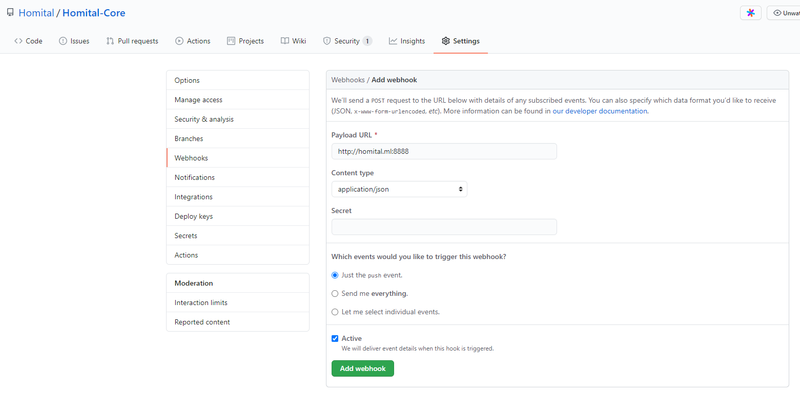
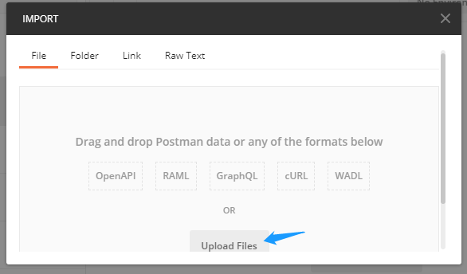
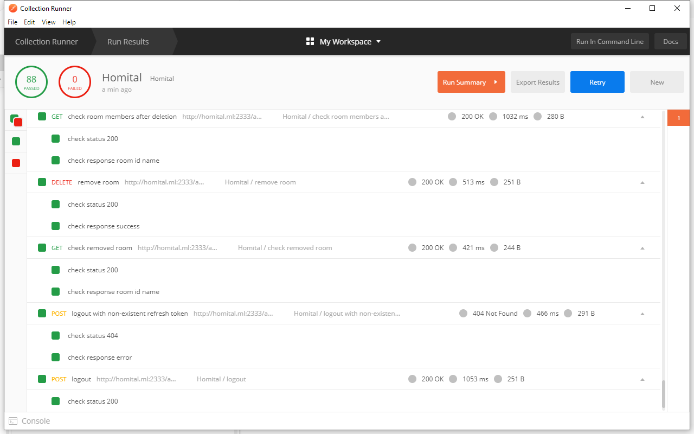

# Homital-Core

[GitHub](https://github.com/Homital/Homital-Core)

Homital-Core is the backend of the Homital system.

## Architecture

Once correctly set up, Homital-Core exposes all its services as APIs at `http://homital.ml:2333/api/` or `https://homital.ml:2333/api/` if ran in production mode. It is also possible to specify the port as a command line argument.

The API documentation can be found [here](https://app.swaggerhub.com/apis-docs/Homital/Homital-Core/0.1.0/)

## Database Model


## Project Structure

```homital
.
├── .github (GitHub configuration files)
│   └── ISSUE_TEMPLATE
│   │   └── ...
│   │ 
├── app
│   ├── db (Database models and functions)
│   │   ├── models (Schema and model definitions)
│   │   │   ├── device.js (Device model)
│   │   │   ├── room.js (Room model)
│   │   │   ├── status.js (Status model)
│   │   │   ├── token.js (Token model)
│   │   │   └── user.js (User model)
│   │   └── db.js (Database functions)
│   │ 
│   ├── routers (Routers)
│   │   │── api.js (Routes all API requests to their specific endpoints)
│   │   │── auth.js (Handles authentication requests)
│   │   │── device.js (Handles requests from devices)
│   │   │── deviceupdates.js (Handles device update requests)
│   │   └── user.js (Handles user requests)
│   │ 
│   ├── utils (Shared utilities)
│   │   └── utils.js
│   │ 
│   └── index.js (App entry point)
│ 
├── tests
│   ├── API_tests
│   │   ├── Homital.postman_collection.json (Postman Collection)
│   │   ├── Homital.postman_environment.json (Postman Environment)
│   │   └── Homital.postman_test_run.json (Postman test result)
│   └── unit_tests
│       └── test.js (Mocha test script)
│── .eslintrc.yml
│── .gitignore
│── .gitpod.yml
│── .remarkrc
│── README.md
│── package-lock.json
│── package.json
└── serve_log.js (Serves logs to aid development)
```

## Setup

### Local Setup

Follow the steps below to set up the project on a Ubuntu server.

1. Open a shell session (maybe through SSH)
1. Install pre-requisites:
   - Python 3 (Miniconda)
     - Update package information: `sudo apt update`
     - Install curl and git: `sudo apt install curl git`
     - Download and install Miniconda: `sh -c "$(curl -fsSL https://repo.anaconda.com/miniconda/Miniconda3-latest-Linux-x86_64.sh)"`
       - During the installation, you will be prompted to choose where to install Miniconda, if you are not sure what this means, just use the default location
       - When the installation finishes, it will show some bash commands which should have been automatically appended to your bashrc, if you are using another shell like zsh, copy the commands to the respective rc file and load the file: `source <YOUR-RC-FILE>`
     - Test Python installation: `python --version`
   - Node.js
     - Install NVM (Node Version Manager): `curl -o- https://raw.githubusercontent.com/nvm-sh/nvm/v0.35.3/install.sh | bash`
     - Follow the instructions to append the provided commands to the end of your shell's rc file and load the file
     - Verify the installation: `command -v nvm`
     - Install the latest LTS version of node: `nvm install node`
     - Test the node installation: `node -v`
1. Clone the repository: `git clone https://github.com/Homital/Homital-Core.git`
1. Inside the cloned folder, run `npm install` to install Node.js dependencies
1. Create a file `.env` under the root directory of the repository and add the following entries, each on a new line, following by `=<ITS_VALUE>`
   - `ACCESS_TOKEN_SECRET`
   - `REFRESH_TOKEN_SECRET`
   - `HOMITALDB_CONNECTIONSTRING`
   - `HTTPS_KEY`
   - `HTTPSCERT`
   - `NOREPLY_EMAIL_HOST`
   - `NOREPLY_EMAIL_PORT`
   - `NOREPLY_EMAIL_ADDR`
   - `NOREPLY_EMAIL_PASS`
1. To automatically pull the latest commits from GitHub, clone this repository: `git clone https://github.com/Homital/WebHook.git`
1. Open `config.py` and edit the `GIT_REPO_PATH` value so that it matches the path of the `Homital-Core` repository we just cloned
1. Install `screen`: `sudo apt update&&sudo apt install screen`
1. Start the python script `autoPull.py` in a new screen session: `screen -S webhook -dm bash -c "python <path_to_autoPull.py>"`

Watch it in a recording:

::: danger
missing `npm install`, if no time, ignore the issue and delete this block
:::

[](https://asciinema.org/a/349158)

### Cloud Setup

It is possible to develop Homital-Core in the cloud using [Gitpod](https://gitpod.io/) as long as you have a stable connection.

Click on the following badge to open Homital-Core in Gitpod: [](https://gitpod.io/#https://github.com/Homital/Homital-Core)

When Gitpod opens the repository, it will automatically install Node.js dependencies, so there is no need to do `npm install`. However, you still need to create and edit the `.env` file. as seen in the last section (step3).

### Continuous Integration

If you followed the manual setup above and installed `Homital/WebHook`, it would listen to port `8888` for incoming `POST` requests. A `POST` request will trigger a `git pull` to get the latest updates from GitHub. To automatically update when the code on GitHub is updated, open the repo on GitHub, go to `Settings` -> `Webhooks` -> `Add webhook`, and put `http://<SERVER-IP-ADDRESS-OR-DOMAIN>:8888` in the `Payload URL` field. `Content type` and `secret` do not matter. Under `Which events would you like to trigger this webhook?`, choose `Just the push event`, and mark it `active`. Save the new webhook. If confused, see the picture below.



## Testing

### Unit Testing

`test/unit_tests/test.js` is a Mocha test script that tests all non-database-related functions.

Run it with `npm test`.


### API Testing

The `test/API_tests` folder contains Postman collection with test scripts for all listed APIs and environment variables.

- `Homital.postman_collection.json` is a Postman Collection
- `Homital.postman_environment.json` is a Postman Environment
- `Homital.postman_test_run.json` is the Postman test results

Download `Homital.postman_collection.json` and `Homital.postman_environment.json`.

Import the two files:





Select the imported environment:


Check the environment:


Run collection:


Select options and run:


Results:


