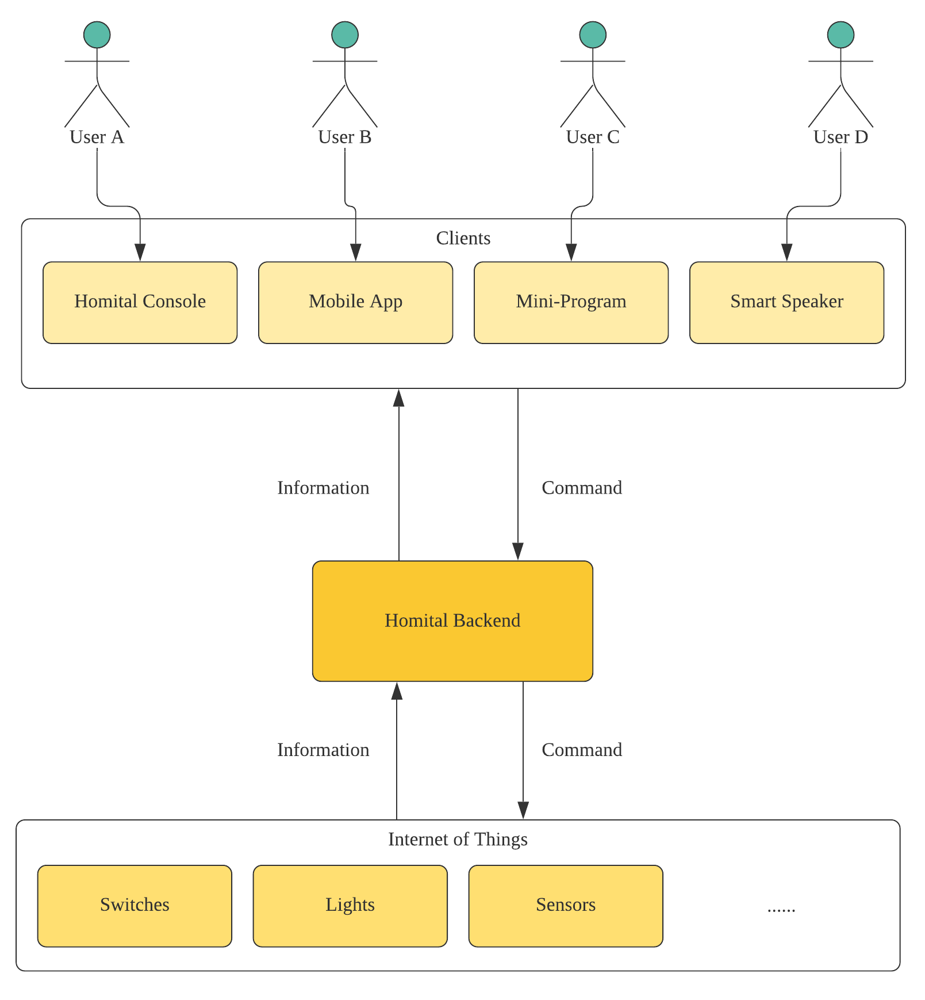
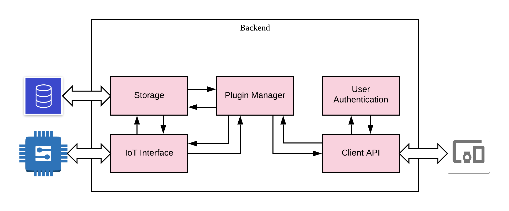
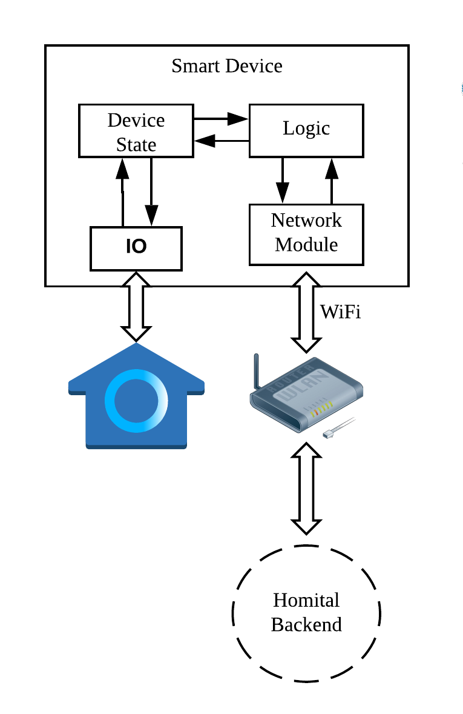
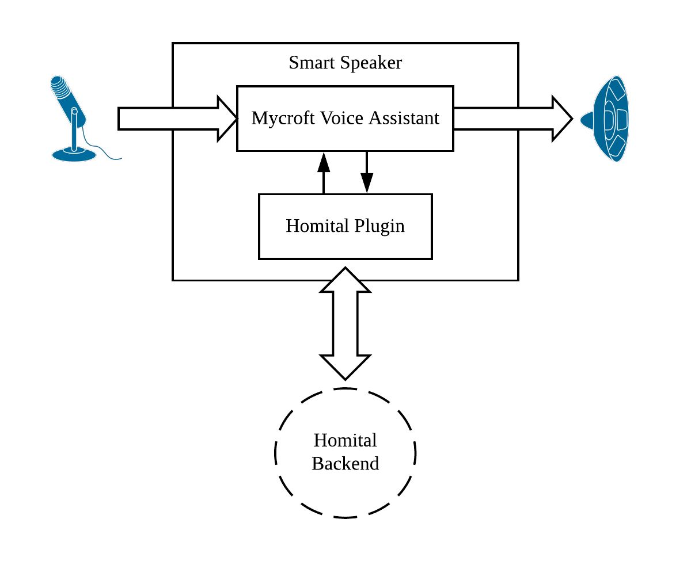

# Developer Guide

## Setting up

TBC

## Design

### Architecture

### Backend

### Website

### Mobile App

### Mini-Program

### Smart Device

### Smart Speaker

## Implementation

## Documentation

Vuepress intro, gitpod setup

## Testing

## Dev Ops

## Appendix A: Product Scope

## Appendix B: User Stories

