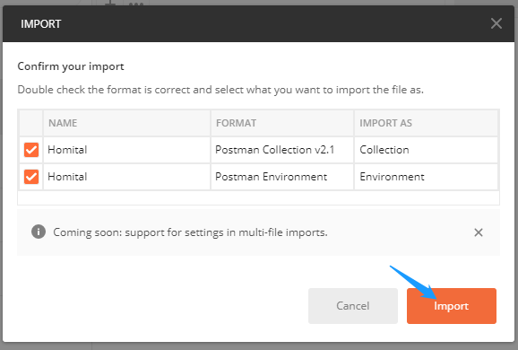
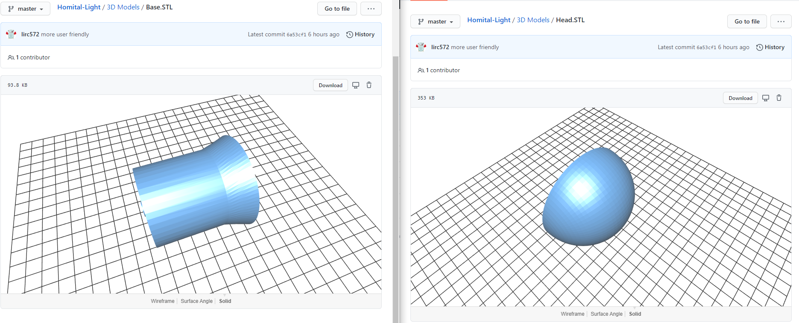

# Developer Guide

[[toc]]

## Overview

Here is the overall architecture of the Homital Project (blurred components are to be implemented in the future):


Currently, the Homital Project is made up of 5 main components:

- Homital-Core
  - The server-side application
- Homital-App
  - The cross-platform client app
- Homital-Lamp
  - A smart lamp
- Homital-USB-Adapter
  - A smart USB adapter
- Homital.github.io
  - This documentation

All of these components will be discussed in separate sections below.

## Homital-Core

[GitHub](https://github.com/Homital/Homital-Core)

Homital-Core is the backend of the Homital system.

### Architecture

Once correctly set up, Homital-Core exposes all its services as APIs at `http://homital.ml:2333/api/` or `https://homital.ml:2333/api/` if ran in production mode. It is also possible to specify the port as a command line argument.

The API documentation can be found [here](https://app.swaggerhub.com/apis-docs/Homital/Homital-Core/0.1.0/)

### Project Structure

```
.
├── .github (GitHub configuration files)
│   └── ISSUE_TEMPLATE
│   │   └── ...
│   │ 
├── app
│   ├── db (Database models and functions)
│   │   ├── models (Schema and model definitions)
│   │   │   ├── device.js (Device model)
│   │   │   ├── room.js (Room model)
│   │   │   ├── status.js (Status model)
│   │   │   ├── token.js (Token model)
│   │   │   └── user.js (User model)
│   │   └── db.js (Database functions)
│   │ 
│   ├── routers (Routers)
│   │   │── api.js (Routes all API requests to their specific endpoints)
│   │   │── auth.js (Handles authentication requests)
│   │   │── device.js (Handles requests from devices)
│   │   │── deviceupdates.js (Handles device update requests)
│   │   └── user.js (Handles user requests)
│   │ 
│   ├── utils (Shared utilities)
│   │   └── utils.js
│   │ 
│   └── index.js (App entry point)
│ 
├── tests
│   ├── API_tests
│   │   ├── Homital.postman_collection.json (Postman Collection)
│   │   ├── Homital.postman_environment.json (Postman Environment)
│   │   └── Homital.postman_test_run.json (Postman test result)
│   └── unit_tests
│       └── test.js (Mocha test script)
│── .eslintrc.yml
│── .gitignore
│── .gitpod.yml
│── .remarkrc
│── README.md
│── package-lock.json
│── package.json
└── serve_log.js (Serves logs to aid development)
```

### Setup

#### Local Setup

Follow the steps below to set up the project on a Ubuntu server.

1. Open a shell session (maybe through SSH)
2. Install pre-requisites:
   - Python 3 (Miniconda)
     - Update package information: `sudo apt update`
     - Install curl and git: `sudo apt install curl git`
     - Download and install Miniconda: `sh -c "$(curl -fsSL https://repo.anaconda.com/miniconda/Miniconda3-latest-Linux-x86_64.sh)"`
       - During the installation, you will be prompted to choose where to install Miniconda, if you are not sure what this means, just use the default location
       - When the installation finishes, it will show some bash commands which should have been automatically appended to your bashrc, if you are using another shell like zsh, copy the commands to the respective rc file and load the file: `source <YOUR-RC-FILE>`
     - Test Python installation: `python --version`
   - Node.js
     - Install NVM (Node Version Manager): `curl -o- https://raw.githubusercontent.com/nvm-sh/nvm/v0.35.3/install.sh | bash`
     - Follow the instructions to append the provided commands to the end of your shell's rc file and load the file
     - Verify the installation: `command -v nvm`
     - Install the latest LTS version of node: `nvm install node`
     - Test the node installation: `node -v`
3. Clone the repository: `git clone https://github.com/Homital/Homital-Core.git`
4. Inside the cloned folder, run `npm install` to install Node.js dependencies
3. Create a file `.env` under the root directory of the repository and add the following entries, each on a new line, following by `=<ITS_VALUE>`
   - `ACCESS_TOKEN_SECRET`
   - `REFRESH_TOKEN_SECRET`
   - `HOMITALDB_CONNECTIONSTRING`
   - `HTTPS_KEY`
   - `HTTPSCERT`
   - `NOREPLY_EMAIL_HOST`
   - `NOREPLY_EMAIL_PORT`
   - `NOREPLY_EMAIL_ADDR`
   - `NOREPLY_EMAIL_PASS`
4. To automatically pull the latest commits from GitHub, clone this repository: `git clone https://github.com/Homital/WebHook.git`
5. Open `config.py` and edit the `GIT_REPO_PATH` value so that it matches the path of the `Homital-Core` repository we just cloned
6. Install `screen`: `sudo apt update&&sudo apt install screen`
7. Start the python script `autoPull.py` in a new screen session: `screen -S webhook -dm bash -c "python <path_to_autoPull.py>"`

Watch it in a recording:

::: danger
missing `npm install`, if no time, ignore the issue and delete this block
:::

[](https://asciinema.org/a/349158)

#### Cloud Setup

It is possible to develop Homital-Core in the cloud using [Gitpod](https://gitpod.io/) as long as you have a stable connection.

Click on the following badge to open Homital-Core in Gitpod: [](https://gitpod.io/#https://github.com/Homital/Homital-Core)

When Gitpod opens the repository, it will automatically install Node.js dependencies, so there is no need to do `npm install`. However, you still need to create and edit the `.env` file. as seen in the last section (step3).

#### Continuous Integration

If you followed the manual setup above and installed `Homital/WebHook`, it would listen to port `8888` for incoming `POST` requests. A `POST` request will trigger a `git pull` to get the latest updates from GitHub. To automatically update when the code on GitHub is updated, open the repo on GitHub, go to `Settings` -> `Webhooks` -> `Add webhook`, and put `http://<SERVER-IP-ADDRESS-OR-DOMAIN>:8888` in the `Payload URL` field. `Content type` and `secret` do not matter. Under `Which events would you like to trigger this webhook?`, choose `Just the push event`, and mark it `active`. Save the new webhook. If confused, see the picture below.


### Testing

#### Unit Testing

`test/unit_tests/test.js` is a Mocha test script that tests all non-database-related functions.

Run it with `npm test`.


#### API Testing

The `test/API_tests` folder contains Postman collection with test scripts for all listed APIs and environment variables.

- `Homital.postman_collection.json` is a Postman Collection
- `Homital.postman_environment.json` is a Postman Environment
- `Homital.postman_test_run.json` is the Postman test results

Download `Homital.postman_collection.json` and `Homital.postman_environment.json`.

Import the two files:




Select the imported environment:


Check the environment:


Run collection:


Select options and run:


Results:


## Homital-App

[GitHub](https://github.com/Homital/Homital-App)

## Homital-Light

[GitHub](https://github.com/Homital/Homital-Light)

Homital-Light is a smart light in the Homital family. It is developed on top of the [ESP8266](https://www.espressif.com/en/products/socs/esp8266/overview) WiFi SoC running [MicroPython](https://micropython.org/). The light source used is a [WS2812B](https://cdn-shop.adafruit.com/datasheets/WS2812B.pdf) LED ring.

### Project Structure

```
.
├── 3D Models
│   ├── Base.SLDPRT (the Base as a SolidWorks 2019 Part)
│   ├── Base.STL (3D printable STL model of the base)
│   ├── Head.SLDPRT (3D printable CAD model of the head)
│   └── Head.STL (The Head as a SolidWorks 2019 Part)
│ 
├── upython (MicroPython scripts)
│   ├── lib (Dependencies)
│   │   └── urequests.py (a buggy subset of the CPython requests library)
│   ├── boot.py (the first script getting ran after startup)
│   ├── db.py (local persistent storage functionalities)
│   ├── homital.py (networking utilities)
│   ├── main.py (the script executed right after boot.py)
│   ├── np.py (WS2812B LED functinos)
│   └── readcmd.py (Serial command processing functions)
│ 
│── .gitignore
└── README.md (Project Summary)
```

### Setup

1. Prepare an ESP8266 development board ([the one we use](https://a.aliexpress.com/_dUiLPnV)) and a WS2812B LED ring ([the one we use](https://a.aliexpress.com/_dYrcykT)).
2. Connect the LED ring's VCC wire to your dev-board's VCC pin, GND to GND, and Date-in to Pin 0 on the dev-board.
3. Clone the Git repository: `git clone https://github.com/Homital/Homital-Light.git`.
4. Connect The ESP8266 development board to your PC via a USB-TTL converter or FTDI adapter. If your dev board already has the chip soldered on it, simply use a USB cable.
5. Download the latest MicroPython firmware from [here](http://micropython.org/download/esp8266/).
6. Install [Thonny Python IDE](https://thonny.org/)
7. Open Thonny IDE, go to `Tools` -> `Options` -> `Interpreter` and select MicroPython(ESP8266) from the dropdown menu. Click on the button under `Firmware`, choose your Port and the firmware you just downloaded and click on install.


8. Once the firmware has benn uploaded, close the dialog and you should see a Python shell at the bottom of Thonny window.


9. Then you can open the `/upython` folder in the Files panel of Thonny at the bottom left, and upload all files and directories to the dev-board, as shown below.


10. Now you have given birth to a new Homital-Light! Reset the devboard and you are ready to go. To configure the device to work with the Homital system, refer to [User Guide](/guide/user-guide/#homital-smart-device-configuration).

### 3D Printed Case

We have prepared a 3D printable model for Homital-Light. Below are the two STL files needed, click on the links to see rendered previews and download the files.

- [Base.STL](https://github.com/Homital/Homital-Light/blob/master/3D%20Models/Base.STL)
- [Head.STL](https://github.com/Homital/Homital-Light/blob/master/3D%20Models/Head.STL)



It is recommanded to print the models using a SLA printer because the models are not optimized for FDM printing. A finished print is shown below:


## Homital-USB-Adapter

[GitHub](https://github.com/Homital/Homital-USB-Adapter)

Homital-USB-Adapter is a smart usb adapter of the Homital family. Like [Homital-Light](#homital-light), Homital-USB-Adapter is also developed on top of [ESP8266](https://www.espressif.com/en/products/socs/esp8266/overview) using [MicroPython](https://micropython.org/). The software of Homital-USB-Adapter is a simplified version of that of Homital-Light.

### Project Structure

```
.
├── upython (MicroPython scripts)
│   ├── lib (Dependencies)
│   │   └── urequests.py (a buggy subset of the CPython requests library)
│   ├── boot.py (the first script getting ran after startup)
│   ├── db.py (local persistent storage functionalities)
│   ├── homital.py (networking utilities)
│   ├── main.py (the script executed right after boot.py)
│   ├── np.py (switch functions)
│   └── readcmd.py (Serial command processing functions)
└── README.md (Project Summary)
```

### Setup

1. Prepare an ESP8266 development board ([the one we use](https://a.aliexpress.com/_dUiLPnV)) and a female USB connector.
2. Connect the USB connector's positive power line to Pin 0 on the ESP8266 dev-board, and negative power line to GND pin on the dev-board.
3. Clone the Git repository: `git clone https://github.com/Homital/Homital-Light.git`.
4. Connect The ESP8266 development board to your PC via a USB-TTL converter or FTDI adapter. If your dev board already has the chip soldered on it, simply use a USB cable.
5. Download the latest MicroPython firmware from [here](http://micropython.org/download/esp8266/).
6. Install [Thonny Python IDE](https://thonny.org/)
7. Open Thonny IDE, go to `Tools` -> `Options` -> `Interpreter` and select MicroPython(ESP8266) from the dropdown menu. Click on the button under `Firmware`, choose your Port and the firmware you just downloaded and click on install.


8. Once the firmware has benn uploaded, close the dialog and you should see a Python shell at the bottom of Thonny window.


9. Then you can open the `/upython` folder in the Files panel of Thonny at the bottom left, and upload all files and directories to the dev-board, as shown below.


10. Now you have set up a new Homital-USB-Adapter! Reset the devboard and you are ready to go. To configure the device to work with the Homital system, refer to [User Guide](/guide/user-guide/#homital-smart-device-configuration).

## Homital.github.io

[GitHub](https://github.com/Homital/Homital.github.io)

Homital.github.io holds this documentation. It is developed with [VuePress](https://vuepress.vuejs.org/).

### Project Structure

```
.
├── docs
│   ├── .vuepress
│   │   └── config.js (VuePress configurations)
│   ├── guide
│   │   ├── assets (Holds static files like images)
│   │   │   └── ...
│   │   │ 
│   │   ├── developer-guide
│   │   │   └── README.md (Developer guide page source)
│   │   ├── user-guide
│   │   │   └── README.md (User guide page source)
│   │   ├── assets
│   │   └── README.md
│   │ 
│   └── README.md (Home page source)
│ 
│── .gitignore
│── .gitpod.yml
│── .travis.yml
│── package.json
│── README.md
└── yarn.lock
```

### Setup

#### Local Setup

1. Install Node.js and yarn (`npm install -g yarn`)
2. Clone the repository: `git clone https://github.com/Homital/Homital.github.io.git`
3. Install dependencies: `yarn install`
4. Start a development server: `yarn docs:dev`

#### Cloud Setup

It is very straight forward to edit the documentations with [Gitpod](https://gitpod.io/). Click on the following badge will open a Gitpod session, which automatically installs all dependencies and start up a development server for preview. The development server theoretically supports hot-reloading, but whether it works or not depends entirely on your luck at the time being :<

[](https://gitpod.io/#https://github.com/Homital/Homital.github.io)

### Deployment

The npm script `docs:build` is used here for generating static site. Run it with `yarn docs:build` and the static files will be generated in `docs/.vuepress/dist`.

### Continuous Integration

This project uses Travis for CI. Each push to GitHub `docs` branch will trigger a build which push generated static webpage to the `master` branch. The master branch is served on GitHub Pages at [https://homital.github.io/](https://homital.github.io/).

To configure the CI process, edit `.travis.yml` file.

## Dev Ops

### Project Management

We use [GitHub Kanban board](https://github.com/orgs/Homital/projects/1) to track our progress and manage our issues.

We set milestones for major updates in the softwares.

During each milestone, we first propose new features to our softwares and put them as issues on respective GitHub repositories. We then assign issus to our members and set a deadline for each issue.

Whenever a feature is completed, we start writing tests to verify the correctness of the implementation. During this process, we open bug reports as issues on GitHub and assign developers to the issues.

When there is a need to add new APIs or update existing APIs, our members will hold a meeting to discuss on the interface and complete the API documentation in the OpenAPI Specification 3.0 format. We then write API tests using Postman. Then the developers can work on the server and the client seperately.

### Continuous Integration

Many of our softwares, including this documentation site, use [Travis CI](https://travis-ci.com/) for continuous integration.

### Code Review Analysis

We use [Codacy](https://www.codacy.com/), together with [ESLint](https://eslint.org/) and [remarklint](https://github.com/remarkjs/remark-lint) for code quality checking. Code quality badges are put on the top-level README.md files for each repository.

<style>
img
{
  -moz-transition: all 0.5s ease;
  -webkit-transition: all 0.5s ease;
  -o-transition: all 0.5s ease;
  transition: all 0.5s ease;
}
img:hover
{
  -moz-transform: scale(1.05);
  -webkit-transform: scale(1.05);
  -o-transform: scale(1.05);
  transform: scale(1.05);
}
</style>
