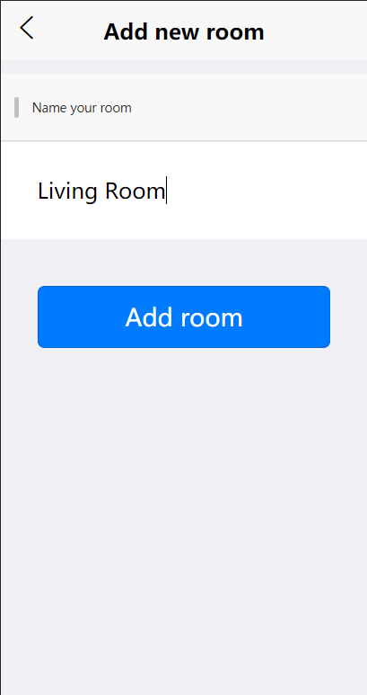
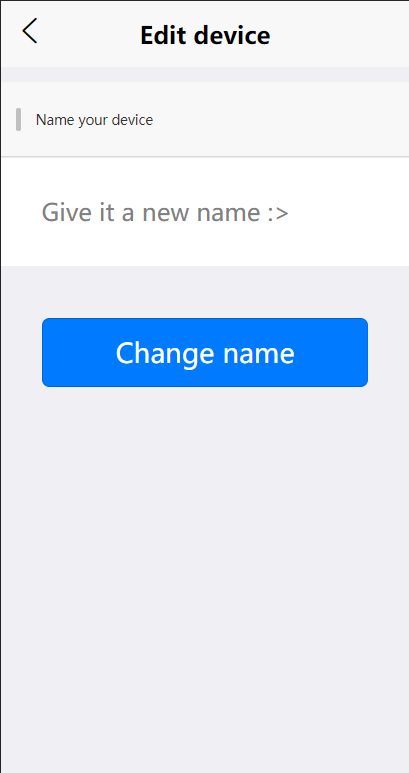
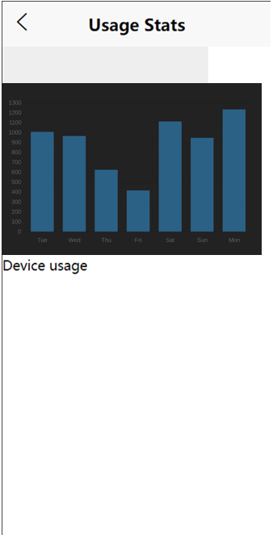
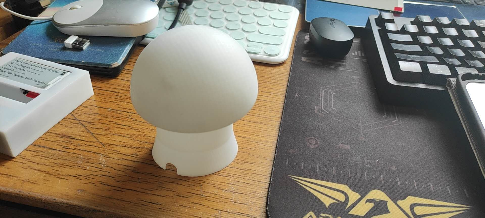

# User Guide

[[toc]]

## Overview

This user guide provides users with the complete features in Homital App, as well as how users should use these features.

## Quickstart

1. Open Homital App. A browser friendly version is available [here](https://www.homital.ml/#/)
2. Register for an account
3. Log in and add devices
4. Configure your devices (see [here](#homital-smart-device-configuration))
5. Enjoy your time

## App Features

### 1. Forget password

If users forgot their password, users should click the "Forgot your password?" at Homital Login page.

Users will then be directed to the Homital Find password page.

Users will be able to see the placeholder to type in their email address. Users should click on the Get Verification Code button. An email with verification code will be sent to the user's email address.

After keying in the verification code, users should click the ‘Get password’ button. Users will then receive an email including a temporary password.

Users can then use this temporary password to log in. Users can also update the password using the temporary password (See Update password feature).

### 2. Change password

If users want to change to a new password, users should click the "Change password" at Homital Login page.

Users will then be directed to the Homital Change password page.

Users will be able to see the placeholder to type in their email address, old (or temporary) password and new password. Users should click on the UpdatePassword button to update their password.

### 3. View rooms

Users can easily see the rooms they have added to Homital App at Homital room list page.

Users can add new rooms by clicking on the "Add Room" button (See feature 4.Add new room to home). By clicking on a particular room, users will be able to clearly see the added devices in that room (See feature 8.Get devices in room) Users can also delete room (See feature 7.Delete selected room), as well as to view room details and perform other operations, such as edit room name (See featue 6.Edit room name feature).

### 4. Add new room to home

Users can add new rooms by clicking on the "Add Room" button  on Homital room list page. Users will then be directed to Add new room page (Fig.11).

Users should type in their wanted room name and click "Add room" button. If the room is added successfully, users will be automatically redirected back to room list page where they will see their new room displayed.

### 5. Edit room name

Users who wish to change their room names should click on the room they wish to edit at Homital room list page.

Users will then be directed to the device list page.

Users should click on "Click to view room details" where they will be directed to the Room detail page.

Users will see their role in this room from "You are {role} of this room" and see the current room name. To change the room name, users should click on the change button, where they will be directed to rename room page (Fig.13).

Users should then key in a new room name and click the "Change name" button.

### 6. Delete selected room

Users who wish to delete rooms should click on the "delete this room" button at Homital Room detail page.

The current room as shown in the room detail page, as well as all the devices and users information will then be deleted.

### 7. Show devices in room

Users can easily see the devices they have added to selected room at Homital device list page.

Users can add new devices by clicking on the "Add device" button (See feature 8. Add new device to room). By clicking on a particular device, users will be able to perform operations on the device (See feature Run supported operations on selected device). Users can also delete device (See feature 10. Delete selected device), as well as to perform other operations, such as edit device name (See feature 9. Edit device name).

### 8. Add new device to room

Users can add new devices by clicking on the "Add device" button on Homital device list page.

Users will then be directed to Add device page.

Users should selected their device type, type in their wanted device name and click "Add this device" button. If the device is added successfully, users will be automatically redirected back to device list page where they will see their new device displayed.

### 9. Edit device name

Users who wish to change their device names should click on the device they wish to edit at Homital device list page.

Users will then be directed to the control device page.

Users will see the current device name. To change the device name, users should click on the view/edit button, where they will be directed to edit device page.

 Users should then key in a new device name and click the "Change name" button.

### 10. Delete selected device

Users who wish to delete devices should click on the "delete this device" button at Homital control device page. 

The current device as shown in the control device page will then be deleted.

### 11. Add new members with control to selected room

Users who have added certain rooms and wish to allow their family members or friends to control the devices in their rooms can add access for their family members or friends using the add new members feature in their rooms. At page showing member list for a room, to add new members, users should click on the "Add More User" tab at the bottom of User List.

Users will then be directed to the Add user page.

Users will need to key in valid, correct username of their family members or friends. Users can also specify role of these memebers so that some will be allowed to make changes to this room while others might only operate on existing devices without making any modifications. User can also give a room name to the member added. After entering these necessary information, users should click on the "Add member" button. If the member is added successfully, the new member and his/her role will be displayed under User List as shown above.

### 12. Display members with particular room access

To view the members who have access to particular rooms, users should navigate to room details page, where users can view the members and their roles under user list.

### 13. Edit role(admin, viewer...) of members on selected room

To edit access of a member on a particular room, users should click on the view button on the specific member under user list. Users will then be directed to the member detail page.

Users should then click on the change button and go to edit member page.

Users can then select on new role and click "edit member" button to change access of a particular member.

### 14. Disallow particular members from controlling selected room

To stop a member from controlling users' rooms, users can simply click the "delete member" button at Homital member detail page.

The current member will no longer have access to the current room.

### 15. Obtain list of supported operations for selected device

To get the list of supported operations on a device, users can simply click to the device at device list page.

Users will then be directed to device operation page.

The supported operation for the current device will be displayed under operation list.

### 16. Run supported operations on selected device

At control device page , users can run the supported operations on their devices. For example, in the following case the plug is currently switched off.

By tapping the switch button, the plug is switched on.

### 17. View usage statistics for devices

Users can view their device usage statistics here.

## Homital Smart Device Configuration

Now that you have added your device in the Homital App, it is time to configure your homital device!

::: tip
In the instructions below, we use the Homital-Light as an example, but the same instructions also apply to Homital-USB-Adapter.
:::

First, install a serial monitor program on your computer. Some potions are [PuTTY](https://www.chiark.greenend.org.uk/~sgtatham/putty/), [Arduino](https://www.arduino.cc/en/main/software), [pySerial](https://pythonhosted.org/pyserial/index.html) and [screen](https://linux.die.net/man/1/screen). Here we will use pySerial to demonstrate.

Take out your Homital-Light:

Use a Micro-USB to connect your Homital-Light to your PC. Refer to the picture below for how to connect the Homital-Light.

Notice that some versions of Homital-Light have two Micro-USB female ports. If that's the case, use the one that has a rectangular chip labelled `WCH CH340G` soldered next to it, the chip is shown below. You can also see this chip on the PCB in the picture above. (Note that the other micro-USB port can be used to power the device)

Once the light is powered, it will show a startup pattern, where the color will change from red to green to blue, as shown below.

Then, it will try to connect to WiFi, while showing spinning red light.

Open your serial communication program and connect to Homital-Light's port using `115200` as baud rate. For pySerial, open a terminal window and enter `python -m serial.tools.miniterm <PORT_OF_HOMITAL_LIGHT> 115200`.

After a while, you will be prompted to enter commands. This is where you configure your Homital-Light to connect to WiFi and Homital-Core.

Supported commands:
  - `wifi <SSID> <PASSWORD>`
    - Set your WiFi credentials
  - `setByName <HOMITAL_USERNAME> <ROOMNAME> <DEVICENAME>`
    - Configure the device using username, roomname and devicename (must match what you created in Homital App)
  - `setById <ROOM_UID> <DEVICENAME>`
    - Configure the device  using room uid and devicename
    - This command is not recommanded because normally you will not see the uid of rooms in Homital App, unless you are using a third-party client

The picture below shows how to configure Homital-Light using pySerial.

Now you are ready to control your Homital-Light in Homital-App!

